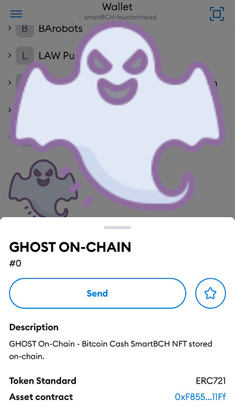

# GHOST ON-CHAIN - Bitcoin Cash SmartBCH NFT

NFT image and metadata are stored on-chain.

Symbol: GHOST

Name: GHOST ON-CHAIN

Contract id: 0xF8552a96100283BebD16B19F1b0F1cb1f18A11Ff

_This is an experimental NFT._

## Tutorial

_(this is not the best way to create on-chain NFT image;-)_

Prepare a small image in png format (less than 10kb) or use the image from this repository `img/0.png`.

Open [Base64 png converter](https://base64.guru/converter/encode/image/png) and upload the image. In the "Output Format" field choose `Data URI--data:content/type;base64`. Encode it.

Copy Base64 output string and paste it to eg. notepad. Save it. You can paste the string to a web browser to see the image.

It should be something like [this](ghostpngbase64.txt).

Open sample_metadata.json and paste the encoded output string to `"image": "...",`

It should be something like [this](ghostmetadatabase64.json)

Open [Base64 file converter](https://base64.guru/converter/encode/file), upload and encode the sample_metadata.json. In the "Output Format" field choose `Plain text - just the Base 64 file`. Encode it.

It should be something like [this](ghostmetadatabase64.txt). This is the token uri (token id 0) used in GHOST ON-CHAIN NFT.

_Token id 0 [transaction](https://www.smartscan.cash/transaction/0x7ab17aceaa000ad246867f3b310412ad19c45c398f5b6461253874c4e7274748)_

That is what it looks in MetaMask

## Contract

_You can try it on SmartBCH Amber testnet. Check [here](https://mazetoken.github.io/smartBCH-resources) how to add SmartBCH testnet to MetaMask and add NFT._

[Source code](https://github.com/mazetoken/ghost)

Open GhostOnChain.sol in [Remix](https://remix.ethereum.org) - solidity. Change token name and symbol. Compile it and deploy.

In "Deploy & and run transactions" section use `safeMint` function to mint NFT (paste your address in `to` field and encoded string in `uri` field). Use your sample_metadata.json base64 encoded string (or ghostmetadatabase64.json encoded string for a test) as uri. Click `transact`. To check the uri go to `tokenURI` function and type `0`. Call the function. You should see `0:
string: data:@file/json;base64,ew0KICAibmFtZSI6ICJHSE9TVCBPTi1DSEFJTiIsDQogICJkZXNjcmlwdGlvbiI6ICJHSE9TVCBvbi1jaGFpbiBORlQgYXJ0d29yayIsDQogICJleHRlcm5hbF91cmwiOiAiaHR0cHM6Ly9tYXpldG9rZW4uZ2l0aHViLmlvL2dob3N0IiwNCiAgImltYWdlIjogImRhdGE6aW1hZ2UvcG5nO2Jhc2U2NCxpVkJPUncwS0dnb0FBQUFOU1VoRVVnQUFBSUFBQUFDQUNBWUFBQUREUG1ITEFBQUFCbUpMUjBRQS93RC9BUCtndmFlVEFBQWZqVWxFUVZSNG5PMmRlWHhVVlpyM2Y4K3B1bFdwVktxeTczdEkyTU9pN0NKS2kwdHJLOXEyMkczYkN1Z2dUUktVUmZ0OXA1ZUpNNzNZU3FLe(...)`

_[Here](https://github.com/PatrickAlphaC/all-on-chain-generated-nft) is another on-chain NFT example._

Have fun ;-)

------------------------------------------------------------

[Telegram](https://t.me/mazetokens)

